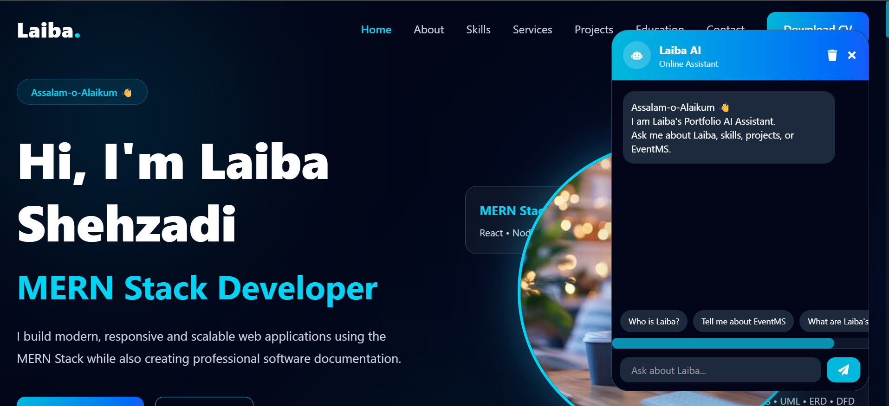

# 🚀 Laiba Portfolio

AI Powered Personal Portfolio Website built with React, Node.js, Express and Groq AI.

## 🌐 Live Demo

https://laiba-dev.netlify.app/

## ✨ Features

- Modern responsive portfolio design
- AI Portfolio Assistant
- Groq AI Integration
- About Me section
- Skills showcase
- Project showcase
- Contact section
- Smooth animations

## 🛠️ Tech Stack

### Frontend
- React.js
- JavaScript
- Tailwind CSS
- Framer Motion

### Backend
- Node.js
- Express.js

### AI
- Groq AI API

### Deployment
- Netlify
- Railway

## 📌 Featured Project

### College Event Management System (EventMS)

Features:
- Admin Dashboard
- Organizer Dashboard
- Student Dashboard
- Authentication
- Role Based Access
- Event Approval System
- Event Registration System

## 👩‍💻 Developer

**Laiba Shehzadi**

GitHub:
https://github.com/Laiba-Dev12

LinkedIn:
https://www.linkedin.com/in/laiba-iftikhar-a70b5a414